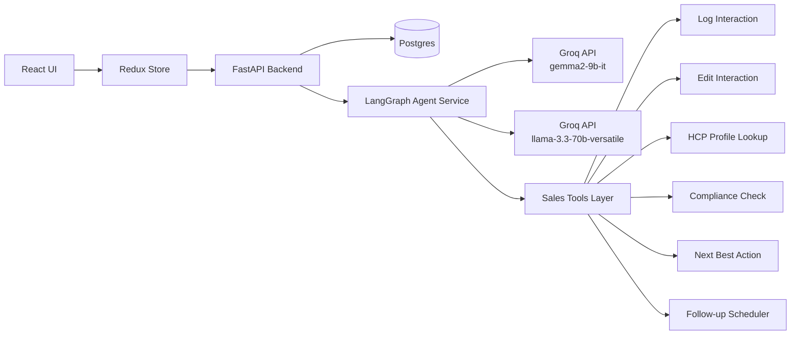
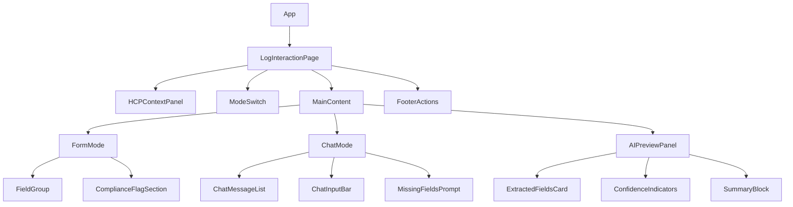
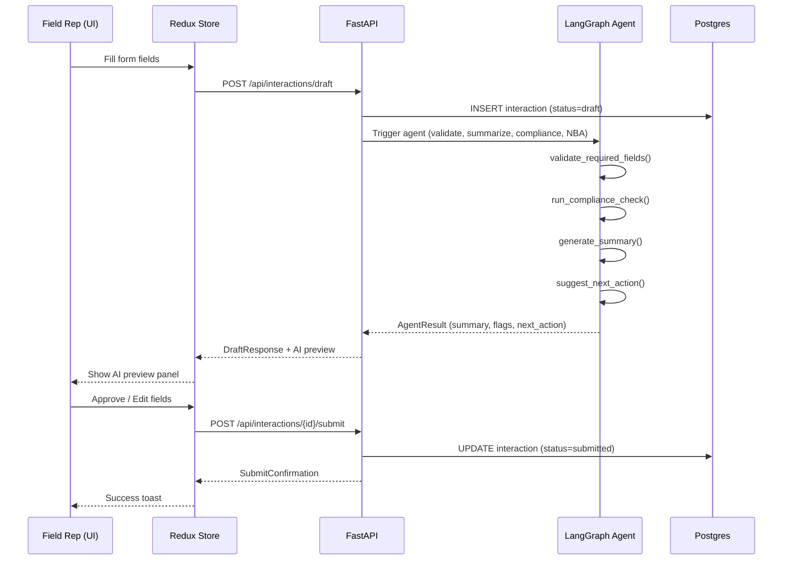
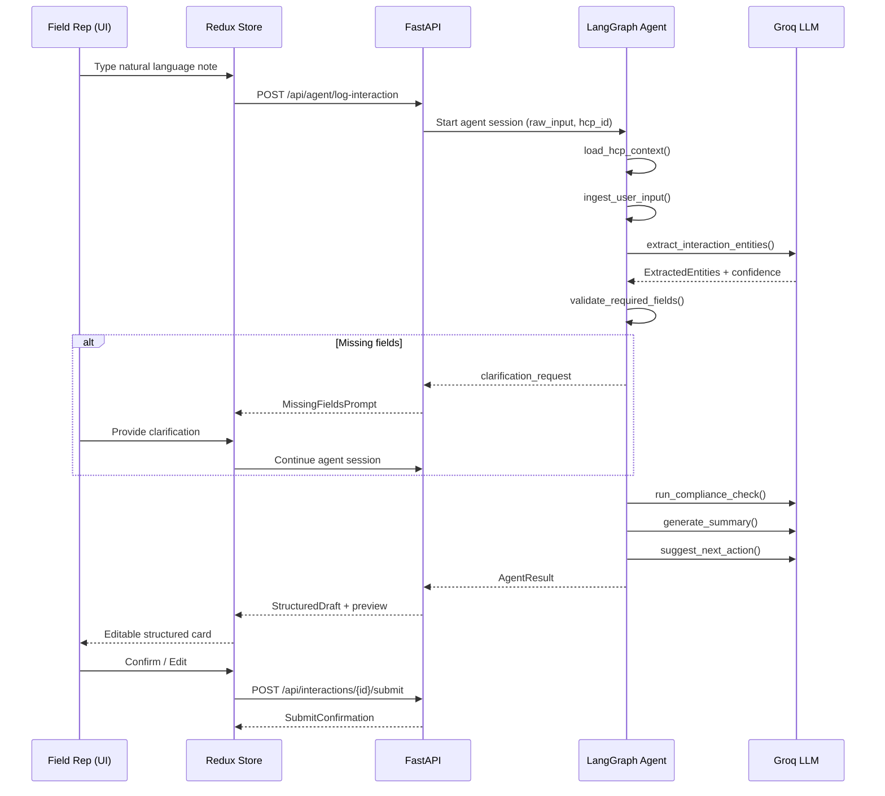

# Design Document: HCP Log Interaction Screen

## Overview

The HCP Log Interaction Screen is the primary field-rep workflow for recording Healthcare Professional (HCP) touchpoints in a Life Sciences CRM. It supports two equivalent input modes — a structured form for fast, compliant entry and a conversational AI chat mode where the rep speaks naturally and the system converts input into clean CRM-ready interaction data. Both modes write into the same canonical interaction object, with raw input, AI interpretation, and user-approved data stored as three distinct layers for full auditability and compliance.

The screen is built on a React + TypeScript frontend backed by a FastAPI service, a LangGraph agent orchestration layer, and Groq-hosted LLMs. The AI-first design reduces rep typing, enforces field completeness, detects compliance risks, and surfaces next-best-action recommendations — all from within a single screen.

This design document covers system architecture, component interfaces, data models, database schema, LangGraph workflow, key algorithms with formal specifications, example usage patterns, correctness properties, error handling, and testing strategy.

---

## Architecture

### System-Level Flow



### Frontend Component Tree




### Sequence Diagrams

#### Form Mode Submission Flow



#### Chat Mode Submission Flow



---

## Components and Interfaces

### Component: HCPContextPanel

**Purpose**: Display HCP identity, specialty, institution, territory, and most recent interaction summary at the top of the screen.

**Interface**:
```typescript
interface HCPContextPanelProps {
  hcpId: string;
  onHCPChange?: (hcpId: string) => void;
}

interface HCPProfile {
  hcpId: string;
  fullName: string;
  specialty: string;
  institution: string;
  territory: string;
  npiNumber?: string;
  lastInteractionDate?: string;
  lastInteractionSummary?: string;
  totalInteractions: number;
}
```

**Responsibilities**:
- Fetch and display HCP profile via RTK Query
- Show loading skeleton while data is in flight
- Surface a "recent interaction" badge linking to interaction history

### Component: ModeSwitch

**Purpose**: Toggle between Structured Form and AI Chat input modes.

**Interface**:
```typescript
type InputMode = 'form' | 'chat';

interface ModeSwitchProps {
  currentMode: InputMode;
  onModeChange: (mode: InputMode) => void;
  disabled?: boolean;
}
```

**Responsibilities**:
- Persist selected mode to `uiSlice`
- Warn the rep if switching modes will discard unsaved work
- Disable toggle while an agent run is in progress


### Component: FormMode

**Purpose**: Structured field-by-field entry form for fast, validated interaction logging.

**Interface**:
```typescript
interface InteractionFormValues {
  hcpId: string;
  interactionType: 'in-person' | 'call' | 'virtual' | 'email' | 'event';
  interactionDate: string;           // ISO 8601
  interactionTime: string;           // HH:MM
  location: string;
  productsDiscussed: string[];
  discussionTopics: string[];
  hcpSentiment: 'positive' | 'neutral' | 'negative' | 'unknown';
  objections: string[];
  sampleProvided: boolean;
  sampleDetails?: string;
  followUpRequired: boolean;
  followUpDate?: string;
  freeTextNotes: string;
  complianceFlags: ComplianceFlagValues;
}

interface ComplianceFlagValues {
  adverseEventMentioned: boolean;
  productComplaintMentioned: boolean;
  offLabelDiscussion: boolean;
  medicalInformationRequest: boolean;
}

interface FormModeProps {
  initialValues?: Partial<InteractionFormValues>;
  onValuesChange: (values: InteractionFormValues) => void;
  validationErrors: Record<string, string>;
  disabled?: boolean;
}
```

### Component: ChatMode

**Purpose**: Natural language input panel with AI-extracted field preview and clarification prompts.

**Interface**:
```typescript
interface ChatMessage {
  id: string;
  role: 'rep' | 'agent';
  content: string;
  timestamp: string;
  type: 'message' | 'extracted_fields' | 'clarification_request' | 'compliance_warning';
  metadata?: Record<string, unknown>;
}

interface MissingField {
  fieldName: string;
  label: string;
  reason: string;
  required: boolean;
}

interface ChatModeProps {
  messages: ChatMessage[];
  missingFields: MissingField[];
  isAgentRunning: boolean;
  onSendMessage: (text: string) => void;
}
```

### Component: AIPreviewPanel

**Purpose**: Right-side panel showing AI-extracted entities, confidence scores, generated summary, and compliance warnings.

**Interface**:
```typescript
interface ExtractedEntities {
  interactionType?: { value: string; confidence: number };
  productsDiscussed?: { value: string[]; confidence: number };
  discussionTopics?: { value: string[]; confidence: number };
  hcpSentiment?: { value: string; confidence: number };
  objections?: { value: string[]; confidence: number };
  followUpRequired?: { value: boolean; confidence: number };
  followUpDate?: { value: string; confidence: number };
  sampleProvided?: { value: boolean; confidence: number };
}

interface AIPreviewPanelProps {
  extractedEntities: ExtractedEntities;
  summary: string;
  complianceWarnings: ComplianceWarning[];
  nextAction?: NextActionSuggestion;
  onEditField: (fieldName: string, value: unknown) => void;
  onRegenerateSummary: () => void;
}

interface ComplianceWarning {
  type: 'adverse_event' | 'product_complaint' | 'off_label' | 'med_info_request';
  severity: 'critical' | 'warning' | 'info';
  message: string;
  fieldRef?: string;
}

interface NextActionSuggestion {
  action: string;
  rationale: string;
  suggestedDate?: string;
  confidence: number;
}
```

---

## Data Models

### Pydantic Models (Backend — Python)

```python
from pydantic import BaseModel, Field
from typing import Optional, List
from enum import Enum
from datetime import datetime, date
import uuid


class InteractionType(str, Enum):
    IN_PERSON = "in-person"
    CALL = "call"
    VIRTUAL = "virtual"
    EMAIL = "email"
    EVENT = "event"


class HCPSentiment(str, Enum):
    POSITIVE = "positive"
    NEUTRAL = "neutral"
    NEGATIVE = "negative"
    UNKNOWN = "unknown"


class HCPProfile(BaseModel):
    hcp_id: str
    full_name: str
    specialty: str
    institution: str
    territory: str
    npi_number: Optional[str] = None
    last_interaction_date: Optional[date] = None
    last_interaction_summary: Optional[str] = None
    total_interactions: int = 0


class ComplianceFlags(BaseModel):
    adverse_event_mentioned: bool = False
    product_complaint_mentioned: bool = False
    off_label_discussion: bool = False
    medical_information_request: bool = False


class InteractionDraft(BaseModel):
    hcp_id: str
    rep_id: str
    interaction_type: Optional[InteractionType] = None
    interaction_date: Optional[datetime] = None
    location: Optional[str] = None
    products_discussed: List[str] = Field(default_factory=list)
    discussion_topics: List[str] = Field(default_factory=list)
    hcp_sentiment: Optional[HCPSentiment] = None
    objections: List[str] = Field(default_factory=list)
    sample_provided: bool = False
    sample_details: Optional[str] = None
    follow_up_required: bool = False
    follow_up_date: Optional[date] = None
    free_text_notes: Optional[str] = None
    compliance_flags: ComplianceFlags = Field(default_factory=ComplianceFlags)


class InteractionRecord(InteractionDraft):
    interaction_id: str = Field(default_factory=lambda: str(uuid.uuid4()))
    status: str = "draft"  # draft | submitted | approved | flagged
    raw_input: Optional[str] = None
    ai_summary: Optional[str] = None
    ai_extracted_entities: Optional[dict] = None
    created_at: datetime = Field(default_factory=datetime.utcnow)
    updated_at: datetime = Field(default_factory=datetime.utcnow)
    submitted_at: Optional[datetime] = None


class ExtractedEntities(BaseModel):
    interaction_type: Optional[dict] = None      # {value, confidence}
    products_discussed: Optional[dict] = None
    discussion_topics: Optional[dict] = None
    hcp_sentiment: Optional[dict] = None
    objections: Optional[dict] = None
    follow_up_required: Optional[dict] = None
    follow_up_date: Optional[dict] = None
    sample_provided: Optional[dict] = None


class ComplianceReview(BaseModel):
    interaction_id: str
    warnings: List[dict] = Field(default_factory=list)
    requires_immediate_action: bool = False
    adverse_event_detected: bool = False
    reviewed_at: datetime = Field(default_factory=datetime.utcnow)


class NextActionSuggestion(BaseModel):
    action: str
    rationale: str
    suggested_date: Optional[date] = None
    confidence: float = Field(ge=0.0, le=1.0)
```


### Redux State Slices (Frontend — TypeScript)

```typescript
// hcpSlice
interface HCPState {
  activeHCP: HCPProfile | null;
  recentInteractions: InteractionSummary[];
  loadingStatus: 'idle' | 'loading' | 'succeeded' | 'failed';
  error: string | null;
}

// interactionDraftSlice
interface InteractionDraftState {
  draftId: string | null;
  fields: Partial<InteractionFormValues>;
  validationErrors: Record<string, string>;
  saveStatus: 'unsaved' | 'saving' | 'saved' | 'error';
  submitStatus: 'idle' | 'submitting' | 'submitted' | 'error';
  inputMode: InputMode;
}

// chatSessionSlice
interface ChatSessionState {
  sessionId: string | null;
  messages: ChatMessage[];
  agentStepStatus: 'idle' | 'extracting' | 'validating' | 'compliance' | 'summarizing' | 'done';
  extractedEntities: ExtractedEntities;
  missingFields: MissingField[];
  confidenceThreshold: number;
}

// agentSlice
interface AgentState {
  toolResults: Record<string, unknown>;
  confidenceScores: Record<string, number>;
  complianceWarnings: ComplianceWarning[];
  nextAction: NextActionSuggestion | null;
  agentRunId: string | null;
  runStatus: 'idle' | 'running' | 'complete' | 'error';
}

// uiSlice
interface UIState {
  activeMode: InputMode;
  isLoading: boolean;
  previewPanelOpen: boolean;
  toasts: Toast[];
  confirmDialogOpen: boolean;
  confirmDialogMessage: string;
}
```

---

## Database Schema

```sql
-- Core HCP table
CREATE TABLE hcps (
    hcp_id          UUID PRIMARY KEY DEFAULT gen_random_uuid(),
    full_name       VARCHAR(255) NOT NULL,
    specialty       VARCHAR(100),
    institution     VARCHAR(255),
    territory       VARCHAR(100),
    npi_number      VARCHAR(20) UNIQUE,
    created_at      TIMESTAMPTZ DEFAULT NOW(),
    updated_at      TIMESTAMPTZ DEFAULT NOW()
);

-- Main interaction record
CREATE TABLE interactions (
    interaction_id      UUID PRIMARY KEY DEFAULT gen_random_uuid(),
    hcp_id              UUID NOT NULL REFERENCES hcps(hcp_id),
    rep_id              VARCHAR(100) NOT NULL,
    interaction_type    VARCHAR(50),
    interaction_date    TIMESTAMPTZ,
    location            VARCHAR(255),
    hcp_sentiment       VARCHAR(50),
    sample_provided     BOOLEAN DEFAULT FALSE,
    sample_details      TEXT,
    follow_up_required  BOOLEAN DEFAULT FALSE,
    follow_up_date      DATE,
    free_text_notes     TEXT,
    raw_input           TEXT,
    ai_summary          TEXT,
    ai_extracted_entities JSONB,
    compliance_flags    JSONB DEFAULT '{}',
    status              VARCHAR(50) DEFAULT 'draft',
    input_mode          VARCHAR(20) DEFAULT 'form',
    created_at          TIMESTAMPTZ DEFAULT NOW(),
    updated_at          TIMESTAMPTZ DEFAULT NOW(),
    submitted_at        TIMESTAMPTZ
);

-- Normalised product linkage
CREATE TABLE interaction_products (
    id              SERIAL PRIMARY KEY,
    interaction_id  UUID NOT NULL REFERENCES interactions(interaction_id) ON DELETE CASCADE,
    product_name    VARCHAR(255) NOT NULL
);

-- Normalised topic linkage
CREATE TABLE interaction_topics (
    id              SERIAL PRIMARY KEY,
    interaction_id  UUID NOT NULL REFERENCES interactions(interaction_id) ON DELETE CASCADE,
    topic           VARCHAR(255) NOT NULL
);

-- Objections captured during visit
CREATE TABLE interaction_objections (
    id              SERIAL PRIMARY KEY,
    interaction_id  UUID NOT NULL REFERENCES interactions(interaction_id) ON DELETE CASCADE,
    objection_text  TEXT NOT NULL
);

-- Full edit audit trail
CREATE TABLE interaction_audit_log (
    log_id          SERIAL PRIMARY KEY,
    interaction_id  UUID NOT NULL REFERENCES interactions(interaction_id),
    changed_by      VARCHAR(100) NOT NULL,
    change_type     VARCHAR(50) NOT NULL,   -- 'create' | 'edit' | 'submit' | 'compliance_flag'
    previous_value  JSONB,
    new_value       JSONB,
    changed_at      TIMESTAMPTZ DEFAULT NOW()
);

-- LangGraph agent execution records
CREATE TABLE agent_runs (
    run_id          UUID PRIMARY KEY DEFAULT gen_random_uuid(),
    interaction_id  UUID REFERENCES interactions(interaction_id),
    rep_id          VARCHAR(100),
    input_mode      VARCHAR(20),
    raw_input       TEXT,
    agent_status    VARCHAR(50),
    tool_trace      JSONB,              -- ordered list of tool calls + results
    model_used      VARCHAR(100),
    token_usage     JSONB,
    started_at      TIMESTAMPTZ DEFAULT NOW(),
    completed_at    TIMESTAMPTZ
);
```


---

## LangGraph Workflow

### Graph State Definition

```python
from typing import TypedDict, Optional, List, Any
from langgraph.graph import StateGraph, END


class AgentState(TypedDict):
    # Identity
    hcp_id: str
    rep_id: str
    interaction_id: Optional[str]
    input_mode: str                     # 'form' | 'chat'

    # Input layer (raw)
    raw_input: Optional[str]
    messages: List[dict]
    form_data: Optional[dict]

    # Context
    hcp_context: Optional[dict]

    # Processing state
    draft_interaction: Optional[dict]
    missing_fields: List[str]
    validation_passed: bool

    # AI output
    extracted_entities: Optional[dict]
    compliance_flags: List[dict]
    ai_summary: Optional[str]
    next_action: Optional[dict]

    # Execution metadata
    tool_results: List[dict]
    model_used: str
    confidence_scores: dict
    clarification_rounds: int

    # Terminal
    status: str                         # 'running' | 'needs_clarification' | 'done' | 'error'
    error: Optional[str]
```

### Node Graph Definition

```python
def build_interaction_graph() -> StateGraph:
    graph = StateGraph(AgentState)

    graph.add_node("load_hcp_context",          load_hcp_context)
    graph.add_node("ingest_user_input",          ingest_user_input)
    graph.add_node("extract_interaction_entities", extract_interaction_entities)
    graph.add_node("validate_required_fields",   validate_required_fields)
    graph.add_node("request_clarification",      request_clarification)
    graph.add_node("run_compliance_check",       run_compliance_check)
    graph.add_node("generate_summary",           generate_summary)
    graph.add_node("suggest_next_action",        suggest_next_action)
    graph.add_node("save_draft",                 save_draft)

    graph.set_entry_point("load_hcp_context")
    graph.add_edge("load_hcp_context",              "ingest_user_input")
    graph.add_edge("ingest_user_input",             "extract_interaction_entities")
    graph.add_edge("extract_interaction_entities",  "validate_required_fields")

    graph.add_conditional_edges(
        "validate_required_fields",
        route_after_validation,
        {
            "needs_clarification": "request_clarification",
            "valid":               "run_compliance_check",
        }
    )
    graph.add_edge("request_clarification",     "ingest_user_input")   # re-enter loop
    graph.add_edge("run_compliance_check",      "generate_summary")
    graph.add_edge("generate_summary",          "suggest_next_action")
    graph.add_edge("suggest_next_action",       "save_draft")
    graph.add_edge("save_draft",                END)

    return graph.compile()


def route_after_validation(state: AgentState) -> str:
    if state["missing_fields"] and state["clarification_rounds"] < 3:
        return "needs_clarification"
    return "valid"
```

---

## Key Functions with Formal Specifications

### `extract_interaction_entities()`

```python
async def extract_interaction_entities(state: AgentState) -> AgentState:
    ...
```

**Preconditions:**
- `state["raw_input"]` is a non-empty string OR `state["form_data"]` is a non-empty dict
- `state["hcp_context"]` has been populated by `load_hcp_context`
- Groq client is available and authenticated

**Postconditions:**
- `state["extracted_entities"]` is populated with at least the fields that could be inferred
- Each entity value carries a `confidence` float in `[0.0, 1.0]`
- Fields with confidence below threshold are added to `state["missing_fields"]`
- `state["model_used"]` is set to either `"gemma2-9b-it"` or `"llama-3.3-70b-versatile"`
- `state["tool_results"]` gains one entry recording this tool call

**Loop Invariants:** N/A (single LLM call, no loop)

**Confidence Threshold Rule:** Fields below `0.6` confidence are treated as missing; fields between `0.6–0.8` are surfaced with a visual indicator; fields above `0.8` are auto-accepted.

### `validate_required_fields()`

```python
def validate_required_fields(state: AgentState) -> AgentState:
    ...
```

**Preconditions:**
- `state["extracted_entities"]` or `state["form_data"]` is present
- `REQUIRED_FIELDS` constant is defined: `['hcp_id', 'interaction_type', 'interaction_date', 'products_discussed']`

**Postconditions:**
- `state["missing_fields"]` is a list of field names that are absent or below confidence threshold
- `state["validation_passed"]` is `True` if and only if `missing_fields` is empty
- No mutation to extracted entities

**Loop Invariants:** For each field checked, previously-checked fields remain in their validated state.

### `run_compliance_check()`

```python
async def run_compliance_check(state: AgentState) -> AgentState:
    ...
```

**Preconditions:**
- `state["draft_interaction"]` is non-null
- `state["raw_input"]` or `state["free_text_notes"]` is present for text scanning
- `state["validation_passed"]` is `True`

**Postconditions:**
- `state["compliance_flags"]` is a list of `ComplianceWarning` objects (may be empty)
- If `adverse_event_detected` is `True`, `state["status"]` is set to `"flagged"` immediately
- The compliance check result is stored in `agent_runs.tool_trace`

**Side Effects:** Writes compliance flags back to the `interactions` table via the persistence layer.

### `generate_summary()`

```python
async def generate_summary(state: AgentState) -> AgentState:
    ...
```

**Preconditions:**
- `state["draft_interaction"]` is populated
- `state["extracted_entities"]` is present
- `state["compliance_flags"]` has been evaluated

**Postconditions:**
- `state["ai_summary"]` is a non-empty string summarising the interaction in ≤ 150 words
- Summary does not introduce facts not present in `draft_interaction` or `extracted_entities`
- Model selection: uses `gemma2-9b-it` by default; escalates to `llama-3.3-70b-versatile` if any entity confidence < 0.65 or note length > 1500 tokens

### `suggest_next_action()`

```python
async def suggest_next_action(state: AgentState) -> AgentState:
    ...
```

**Preconditions:**
- `state["hcp_context"]` includes interaction history
- `state["draft_interaction"]` is fully populated
- `state["ai_summary"]` is present

**Postconditions:**
- `state["next_action"]` contains `action`, `rationale`, `suggested_date`, and `confidence`
- `confidence` is in `[0.0, 1.0]`
- Next action does not schedule a follow-up if `follow_up_required` is `False`


---

## Algorithmic Pseudocode

### Main Agent Orchestration Algorithm

```pascal
ALGORITHM run_interaction_agent(hcp_id, rep_id, input_mode, raw_input, form_data)
INPUT:  hcp_id: UUID, rep_id: string, input_mode: 'form'|'chat',
        raw_input: string|null, form_data: dict|null
OUTPUT: AgentResult { draft, summary, compliance_flags, next_action, status }

BEGIN
  ASSERT (raw_input IS NOT NULL) OR (form_data IS NOT NULL)
  ASSERT hcp_id IS NOT NULL AND rep_id IS NOT NULL

  state ← initialise_agent_state(hcp_id, rep_id, input_mode, raw_input, form_data)

  // Phase 1: Context loading
  state ← load_hcp_context(state)
  ASSERT state.hcp_context IS NOT NULL

  // Phase 2: Input ingestion
  state ← ingest_user_input(state)

  // Phase 3: Entity extraction loop
  state ← extract_interaction_entities(state)
  state ← validate_required_fields(state)

  clarification_rounds ← 0
  WHILE state.missing_fields IS NOT EMPTY AND clarification_rounds < 3 DO
    ASSERT clarification_rounds < 3    // Loop variant: rounds strictly increases
    state ← request_clarification(state)
    // Wait for rep reply — re-enter extract + validate cycle
    state ← ingest_user_input(state)
    state ← extract_interaction_entities(state)
    state ← validate_required_fields(state)
    clarification_rounds ← clarification_rounds + 1
  END WHILE
  // After loop: either missing_fields is empty, or max rounds reached
  // If max rounds reached with missing fields, proceed with available data

  // Phase 4: Compliance, summarisation, NBA
  state ← run_compliance_check(state)

  IF state.status = 'flagged' THEN
    // Critical compliance issue — surface to UI immediately
    RETURN AgentResult { status: 'flagged', compliance_flags: state.compliance_flags }
  END IF

  state ← generate_summary(state)
  state ← suggest_next_action(state)

  // Phase 5: Persist draft
  state ← save_draft(state)

  ASSERT state.draft_interaction IS NOT NULL
  ASSERT state.ai_summary IS NOT NULL

  RETURN AgentResult {
    draft:            state.draft_interaction,
    summary:          state.ai_summary,
    compliance_flags: state.compliance_flags,
    next_action:      state.next_action,
    status:           'done'
  }
END
```

**Loop Invariant (Clarification Loop):**
At the start of each iteration, `clarification_rounds` equals the number of completed clarification cycles, and all previously extracted entities remain unchanged unless overridden by newer rep input.

### Entity Extraction Algorithm

```pascal
ALGORITHM extract_interaction_entities(state)
INPUT:  state: AgentState
OUTPUT: state with populated extracted_entities and updated missing_fields

BEGIN
  text ← state.raw_input OR serialise_form_data(state.form_data)
  ASSERT text IS NOT EMPTY

  // Choose model based on input complexity
  IF length(text) > 1500 OR state.clarification_rounds > 0 THEN
    model ← "llama-3.3-70b-versatile"
  ELSE
    model ← "gemma2-9b-it"
  END IF

  prompt ← build_extraction_prompt(text, state.hcp_context, REQUIRED_FIELDS)
  response ← groq_client.chat(model, prompt)
  entities ← parse_extraction_response(response)

  // Score-based field assignment
  FOR each field IN REQUIRED_FIELDS DO
    IF entities[field] EXISTS AND entities[field].confidence >= CONFIDENCE_THRESHOLD THEN
      state.extracted_entities[field] ← entities[field]
    ELSE
      state.missing_fields.append(field)
    END IF
  END FOR
  // Loop invariant: all processed fields are either in extracted_entities or missing_fields

  state.model_used ← model
  state.tool_results.append({ tool: "extract_entities", model: model, result: entities })

  RETURN state
END
```

### Compliance Check Algorithm

```pascal
ALGORITHM run_compliance_check(state)
INPUT:  state: AgentState (with draft_interaction populated)
OUTPUT: state with compliance_flags populated

BEGIN
  ASSERT state.draft_interaction IS NOT NULL
  text ← state.raw_input + " " + state.draft_interaction.free_text_notes

  flags ← []

  // Rule-based fast path (no LLM needed for hard keywords)
  IF contains_adverse_event_keywords(text) THEN
    flags.append({ type: 'adverse_event', severity: 'critical', ... })
    state.status ← 'flagged'
  END IF

  IF contains_product_complaint_keywords(text) THEN
    flags.append({ type: 'product_complaint', severity: 'warning', ... })
  END IF

  // LLM-based nuanced check
  prompt ← build_compliance_prompt(text, state.hcp_context)
  llm_flags ← groq_client.chat("gemma2-9b-it", prompt)
  flags ← merge_flags(flags, parse_compliance_response(llm_flags))

  state.compliance_flags ← flags
  state.tool_results.append({ tool: "compliance_check", flags: flags })

  RETURN state
END
```

### Model Routing Algorithm

```pascal
ALGORITHM select_model(input_text, context, clarification_rounds, low_confidence_count)
INPUT:  input_text: string, context: dict,
        clarification_rounds: int, low_confidence_count: int
OUTPUT: model_name: string

BEGIN
  token_estimate ← estimate_tokens(input_text + serialise(context))

  IF token_estimate > 1500 THEN
    RETURN "llama-3.3-70b-versatile"
  END IF

  IF clarification_rounds >= 2 THEN
    RETURN "llama-3.3-70b-versatile"
  END IF

  IF low_confidence_count >= 3 THEN
    RETURN "llama-3.3-70b-versatile"
  END IF

  RETURN "gemma2-9b-it"   // Primary: fast, cost-effective
END
```

---

## FastAPI Endpoint Specifications

```python
# HCP Endpoints
@router.get("/api/hcps/{hcp_id}",
    response_model=HCPProfile,
    summary="Retrieve HCP profile by ID")
async def get_hcp(hcp_id: str, db: AsyncSession = Depends(get_db)) -> HCPProfile:
    ...
    # Preconditions: hcp_id is a valid UUID string
    # Postconditions: returns HCPProfile or raises 404

@router.get("/api/hcps/{hcp_id}/interactions",
    response_model=List[InteractionSummary])
async def get_hcp_interactions(
    hcp_id: str,
    limit: int = Query(default=10, le=50),
    offset: int = Query(default=0),
    db: AsyncSession = Depends(get_db)
) -> List[InteractionSummary]:
    ...

@router.get("/api/hcps/search")
async def search_hcps(q: str = Query(min_length=2), db: AsyncSession = Depends(get_db)):
    ...

# Interaction Endpoints
@router.post("/api/interactions/draft",
    response_model=InteractionRecord,
    status_code=201)
async def create_draft(
    payload: InteractionDraft,
    background_tasks: BackgroundTasks,
    db: AsyncSession = Depends(get_db)
) -> InteractionRecord:
    ...
    # Triggers background LangGraph agent run
    # Preconditions: payload.hcp_id exists in DB; payload.rep_id is authenticated user
    # Postconditions: interaction row created with status='draft'; agent run queued

@router.put("/api/interactions/{interaction_id}",
    response_model=InteractionRecord)
async def update_interaction(
    interaction_id: str,
    payload: InteractionDraft,
    db: AsyncSession = Depends(get_db)
) -> InteractionRecord:
    ...
    # Writes audit log entry before updating

@router.post("/api/interactions/{interaction_id}/submit",
    response_model=InteractionRecord)
async def submit_interaction(
    interaction_id: str,
    db: AsyncSession = Depends(get_db)
) -> InteractionRecord:
    ...
    # Preconditions: interaction status='draft'; all required fields present
    # Preconditions: no unresolved 'critical' compliance_flags
    # Postconditions: status set to 'submitted'; submitted_at timestamped; audit log entry written

# Agent Endpoints
@router.post("/api/agent/log-interaction",
    response_model=AgentRunResponse)
async def agent_log_interaction(
    payload: AgentLogRequest,
    background_tasks: BackgroundTasks
) -> AgentRunResponse:
    ...
    # Starts a new LangGraph session; returns run_id for polling or WebSocket

@router.post("/api/agent/compliance-check",
    response_model=ComplianceReview)
async def agent_compliance_check(payload: ComplianceCheckRequest) -> ComplianceReview:
    ...

@router.post("/api/agent/next-best-action",
    response_model=NextActionSuggestion)
async def agent_next_best_action(payload: NBARequest) -> NextActionSuggestion:
    ...
```

